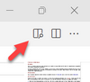

# Exercise: GitHub Basics

## Summary

This is a starter exercise to get everyone up to speed on using GitHub, VS Code, and Markdown for computational assignments. It also gives me some very helpful background information.

If you're viewing this file using VS Code, you can see a nicely formatted version by turning on the Markdown preview pane. The pane is activated by clicking on the small "Open Preview" icon at the upper right that looks like two columns and a magnifying glass:

One other quick note: in this and other readme files this semester, backquotes are often used to indicate code or other things, such as file names, that should be entered directly as-is. In the rendered version (PDF or preview) the text will be shown in a monospaced font and won't have quotes `like this`.

This avoids a "meta-quote" problem: putting quotes around code would be confusing since the code itself can have quotes. For example, the first instruction below is cleaner and clearer than the second:

* Add a line to your script that says `name = "Python"`

* Add a line to your script that says "name = "Python"" but without the outside quotes.

When you're looking at the raw Markdown, you'll see the backquotes but be sure to omit them when you're carrying out the instructions.

## Deliverables

Your finished repository should contain an updated version of **bio.md** plus a new file called **results.md**.

## Instructions

### bio.md

Please use VS Code to revise the accompanying Markdown file `bio.md`. Please make the changes in the steps below. Don't do everything at once: part of the point is to see how successive revisions are logged and tracked.

1. There are five broad questions in the file. The first is about where you're from. Please edit it and **make only one change**: replace the placeholder string `TBD` with your home town.

1. **Stage** that change and then **commit** it to your local repository with a short log message. Please do this **before** going on to make the other changes below.

1. Now go on to the remaining sections. In each case replace the letters `TBD` with a short answer to the question. The answers don't have to be long: a few words or a sentence or two are enough.

1. Make sure your file looks OK in the previewer.

1. Stage and commit that change with an appropriate log message. It's OK to do all the changes for questions 2-5 at once.

### results.md

Now create a new file called `results.md` with the contents described below. If you haven't used Markdown a lot, you might want to look at the `demo.md` file to see examples of some of the Markdown that will be needed.

1. Start with a level 1 heading line that says `Results` (just the word, remember not to include the backquotes in the Readme file).

1. Add some plain text (not a heading) that says `Here is a demonstration of features of Markdown` (again, no backquotes).

1. Add a level 2 heading that says `Three Courses`.

1. Add a *unnumbered* list consisting of any three Maxwell course numbers and titles (e.g., PAI 789 Advanced Policy Analysis).

1. Add a level 2 heading that says `Some Animals` and then add an *numbered* list of any three animals.

1. Add a level 2 heading that says `Linking`.

1. Find a picture of an animal in your list (maybe a pet if you have one) and save the image in the folder with `results.md`. Then do the following to `results.md`: (a) add line of plain text saying what's in the picture, and (b) add an inline link to the image.

1. Add another line of plain text that says `The instructions for this assignment are here` where `here` is a link to this file, `readme.md`.

1. Finally, another level 2 heading that says `Code` and follow it with a Python code block with two short lines of code: the first should be `message ="done"` and the second should be `print(message)`.

1. Finally, make sure your file looks OK in the previewer. It should be formatted correctly, the image should be visible, the link should work, and the code should be in block.

1. Commit `results.md` and your animal image to the repository.

## Submitting

Once you're happy with everything and have committed all of your changes to your local repository, please **push the changes** to GitHub. Don't forget to do that: if you don't push your changes, I won't be able to see them and it will look like you didn't do the assignment.

Then check that the changes are **visible on the GitHub website**. If so, you're done: you have submitted your answer and I'll be able to see and download it. If your changes aren't visible, even after refreshing the page, double-check to make sure you pushed the changes.

## Tips

* Markdown is a very useful tool and we'll use it a fair amount this semester. To learn more, see the Markdown link in the Resources section of the class web page.
